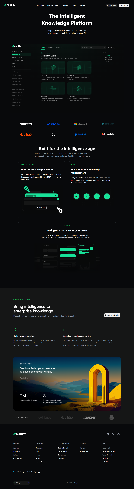

# Mintlify Landing Page Clone

A static clone of the Mintlify marketing landing page built with plain HTML and CSS. This repository recreates the page structure and visual styles from the Mintlify homepage as a learning / portfolio exercise.

---

## What's Included

This project recreates the following sections from the Mintlify landing page:

- **Header / Navigation**: Sticky top navigation with logo, primary links (Resources, Documentation, Customers, Blog, Pricing), and CTAs (`Contact sales`, `Start for free`).
- **Hero**: Prominent headline, descriptive subtitle, and a hero image showcasing the product.
- **Partner Logos**: Grid of partner/customer logos.
- **Features**: Several feature blocks (LLMs.txt & MCP, Agent, Assistant) with images and explanatory text.
- **Enterprise Feature**: Enterprise-focused section with feature blocks, calls-to-action, and a feature illustration.
- **Footer**: Multi-column footer with explore/resources/documentation/company/legal links, social icons, and security/status area.

---

## Design Tokens

### Fonts

- **Primary font stack:** system-ui, -apple-system, BlinkMacSystemFont, 'SF Pro Text', 'Inter', sans-serif — defined in `style.css` and used across headings and body text.

### Colors

Colors are defined in `style.css` via CSS custom properties in the `:root` block. Key variables used in the project:

| Variable          |              Hex (or value) | Usage                                             |
| ----------------- | --------------------------: | ------------------------------------------------- |
| `--bg-dark`       |                   `#08090b` | Page background and header background             |
| `--bg-alt`        |                   `#151616` | Alternate/section backgrounds (enterprise blocks) |
| `--bg-light`      |  `rgba(255, 255, 255, 0.1)` | Subtle light surfaces and hover backgrounds       |
| `--text`          |                   `#ffffff` | Primary text and icon color                       |
| `--text-muted`    |                   `#9ca3af` | Secondary/muted text (subtitles, captions)        |
| `--accent-green`  |                   `#22c55e` | Accent color used for badges/brand highlights     |
| `--border-subtle` | `rgba(148, 163, 184, 0.25)` | Subtle borders for cards and containers           |

---

## Project Structure

```
mintlify-landing-page-clone/
├── index.html          # Single-page markup
├── style.css           # All styles (layout, typography, colors)
├── README.md           # This file
└── assets/
    ├── favicons, logos, and images
    └── logos/          # partner logos used in the logos grid
```

Files you will likely look at first: `index.html` and `style.css`.

---

## Screenshots



---

## How to Run

1. Clone or download the repository.
2. Open `index.html` in a browser, or serve the folder with a local server (for example with VS Code Live Server or `npx serve .`).

No build step or dependencies required.

---

## Tech Stack

- **HTML5** – Semantic sections and accessible markup.
- **CSS3** – Custom properties, Flexbox, Grid and responsive-friendly layout.
- **No build tools** – Static site that runs in any modern browser.

---

## Notes

- This is a learning/portfolio project. Branding and content belong to Mintlify; use this clone for personal or educational purposes only.
